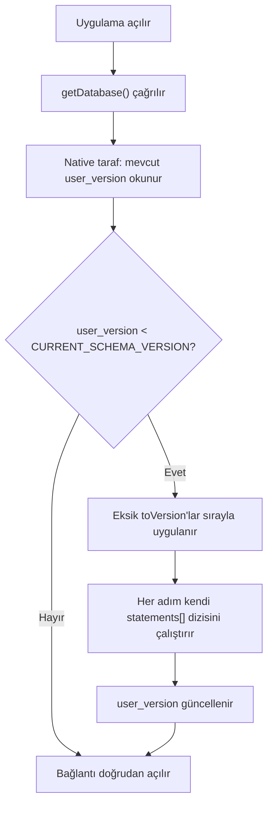

# Belge 1 — Database Migration Strategy

**Durum:** Onay bekliyor · **Tarih:** 2026-07-15
**Çelişmediği belgeler:** ADR 0005 (Migration Stratejisi), ADR 0018 (Test Stratejisi), Database Master Schema

---

## Amaç

SQLite şemasının, projenin 10+ yıllık ömrü boyunca **güvenli, öngörülebilir ve geri dönüşü olmayan hatalar yaratmadan** evrilmesini sağlayacak operasyonel kuralları tanımlamak. Bu belge ADR 0005'in **kararını değiştirmez**, onu üretim seviyesinde uygulanabilir hale getirir.

## Kapsam

`src/data/db/migrations/schema.ts` içindeki `SCHEMA_MIGRATIONS` dizisi ve bu diziyi işleyen `@capacitor-community/sqlite`'ın native `addUpgradeStatement`/`createConnection` mekanizması (ADR 0005). Gelecekteki tüm modüllerin (Observation, Finance, Inventory, Photo, AI) migration'ları bu kurallara tabidir.

---

## Tasarım Kararları

### 1. `schemaVersion` Yapısı (Mevcut, Değişmiyor)
`CURRENT_SCHEMA_VERSION: number` — tek bir artan tam sayı. Her migration bir `{ toVersion: number, statements: string[] }` girişi. Native taraf, veritabanının mevcut `user_version`'ından `CURRENT_SCHEMA_VERSION`'a kadar olan tüm ara adımları sırayla uygular.

### 2. Migration Sıralaması
`SCHEMA_MIGRATIONS` dizisi **sadece eklenir**, sırası asla değiştirilmez, mevcut girişler asla düzenlenmez (ADR 0005). Her yeni migration, dizinin **sonuna**, bir önceki `toVersion + 1` ile eklenir.

### 3. Upgrade Akışı



**Açık araştırma maddesi (dürüstçe belirtiliyor):** Native eklentinin `addUpgradeStatement` mekanizmasının, birden fazla ara `toVersion` adımını **tek bir atomik transaction** içinde mi yoksa **adım adım ayrı transaction'larla** mı uyguladığı, resmi dokümantasyondan kesin doğrulanmadı. Bu, "3 sürüm geride kalmış bir kullanıcıda, 2. adımda hata olursa 1. adım geri alınır mı?" sorusunun cevabını etkiler. **Bu belirsizlik production'da gerçek bir sorun yaratırsa** (ör. gerçek cihazda kısmi migration gözlemlenirse), Capacitor SQLite eklentisinin native (Kotlin) kaynak kodu incelenerek kesinleştirilecek — bugün varsayımla kapatılmıyor.

### 4. Downgrade Politikası

**Downgrade DESTEKLENMEZ.** Bir kez yükseltilen şema geri döndürülemez. Bu bilinçli bir karardır:
- SQLite eklentisi native bir downgrade mekanizması sunmuyor.
- Downgrade desteği eklemek (her migration için ters SQL yazmak) karmaşıklığı ciddi şekilde artırır ve nadiren gerçek bir ihtiyaçtır (Kural 4).
- Alternatif güvenlik ağı: manuel yedekleme (ADR 0008) — kullanıcı, riskli bir güncelleme öncesi yedek alabilir.

### 5. Migration Rollback Yaklaşımı

Uygulama seviyesinde "geri alma" yoktur. Tek güvenlik ağı: her migration **idempotent** yazılır (`CREATE TABLE IF NOT EXISTS`, `CREATE INDEX IF NOT EXISTS` — zaten mevcut kodda uygulanan pratik, bu belgeyle resmileşiyor). Böylece bir migration yarım kalıp tekrar denenirse, zaten var olan nesneleri yeniden oluşturmaya çalışıp hata vermez.

### 6. Bozuk Migration Senaryoları

| Senaryo | Politika |
|---|---|
| Kod aşamasında (henüz dağıtılmamış) migration'da hata bulunursa | Doğrudan düzeltilir — henüz kullanıcı cihazında çalışmadı |
| **Dağıtılmış** bir migration'da hata bulunursa | ASLA düzenlenmez (ADR 0005). Düzeltme, yeni bir `toVersion` girişi olarak eklenir (ör. eksik kaydı tamir eden bir `UPDATE`) |
| Migration SQL'i gerçek cihazda hata fırlatırsa | Uygulama açılışı başarısız olur → mevcut `App.tsx` hata ekranı + "Tekrar Dene" butonu (Kural 14, zaten var) devreye girer |

### 7. Migration Test Stratejisi

ADR 0018 (Vitest + better-sqlite3) zaten kurulu. Her yeni migration için **zorunlu checklist**:
1. `SCHEMA_MIGRATIONS`'a yeni `toVersion` eklenir.
2. `parcel.repository.test.ts` deseninde (ilgili modülün) testleri, **gerçek migration SQL'ine karşı** (kopya değil) çalıştırılır.
3. Yeni tablo/sütun için en az: create/list/update/soft-delete testleri.
4. **Gerçek cihazda "eski sürümden güncelleme" senaryosu** test edilir — bu, Modül 1'de zaten kanıtlanmış kritik bir senaryo (kullanıcının "güncelleme olarak yükledi" testi, ADR 0021'in bulunduğu senaryo).

### 8. Production Migration Kuralları

1. Dağıtılmış migration asla düzenlenmez.
2. Her migration idempotent yazılır.
3. Yıkıcı migration'lar (mevcut sütun/tablo silme, veri kaybına yol açabilecek `ALTER`) bugüne kadar hiç kullanılmadı ve **planlanmıyor** — mimari sadece ekleme (additive) deseniyle ilerliyor.
4. Büyük bir migration öncesi (ör. çok sayıda tablo eklenen bir modül), kullanıcıya manuel yedek alma hatırlatması gösterilmesi önerilir (Ayarlar modülü geldiğinde, bugün uygulanmıyor).

### 9. Gelecekte Yeni Tablolar Eklenmesi

Database Master Schema'daki `[PLANLANAN]` tablolar, ilgili modül geldiğinde yeni bir `toVersion` girişi olur. Örnek zaten Master Schema'da mevcut (Observation, Photo, Finance vb.).

### 10. Index Migration

Index ekleme/kaldırma da bir migration'dır (`CREATE INDEX`/`DROP INDEX IF EXISTS`), aynı `toVersion` mekanizmasıyla. **Somut örnek — Database Master Schema'da bulunan gerçek eksiklik:** `UNIQUE(parcel_id, tree_number)` index'i, Ağaç modülü kod aşamasında Sürüm 3'e eklenecek.

### 11. Data Migration

Yeni bir sütun eklenirken mevcut satırların değeri: SQLite'ın `ALTER TABLE ... ADD COLUMN ... DEFAULT ...` söz dizimi bunu otomatik dolduruyor. Daha karmaşık dönüşümler (ör. bir sütunu ikiye ayırmak) aynı migration bloğu içinde `UPDATE` ifadeleriyle yapılır — ayrı bir "data migration" katmanı **yoktur**, şema migration'ıyla aynı mekanizma kullanılır (Kural 4: gereksiz ayrı katman değil).

### 12. Enum Değişiklikleri (ADR 0017 ile Etkileşim)

**Bilinen SQLite platform kısıtı (genel bilgi, araştırma gerektirmiyor):** SQLite'ın `ALTER TABLE`'ı, bir `CHECK` kısıtını doğrudan güncellemeyi desteklemez. Bir enum-kod sütununa (ör. `crop_type`) yeni bir değer eklemek gerekirse (ör. `'nut'`), standart SQLite deseni:
```sql
-- Örnek: crop_type'a yeni değer eklerken izlenecek desen
CREATE TABLE parcels_new (... crop_type TEXT NOT NULL CHECK (crop_type IN ('olive','vegetable','fruit','nut')) ...);
INSERT INTO parcels_new SELECT * FROM parcels;
DROP TABLE parcels;
ALTER TABLE parcels_new RENAME TO parcels;
-- + tüm index'lerin yeniden oluşturulması gerekir
```
Bu **belgeleniyor**, bugün uygulanmıyor (henüz bir enum genişletme ihtiyacı yok).

### 13. Backup Stratejisi ile İlişki

**Açık risk (dürüstçe belirtiliyor):** Migration'lar sırasında **otomatik yedek alınmıyor** — manuel yedekleme modülü (ADR 0008) henüz kodlanmadı. Bu, bugünkü kapsamda kabul edilen bir risktir; ilgili modül geldiğinde ele alınacak.

---

## Alternatifler

| Alternatif | Neden Reddedildi |
|---|---|
| ORM (Drizzle, benzeri) | Modül 1'de zaten bilinçli olarak reddedilmişti — native SQLite + ince repository katmanı tercih edildi |
| Kendi JS tabanlı migration runner'ımız | ADR 0005'te zaten reddedildi — native mekanizma zaten var, tekrar yazmak gereksiz |
| Her migration için ters (down) SQL yazma | Downgrade ihtiyacı yok, karmaşıklık/fayda dengesi olumsuz |

## Neden Bu Karar Seçildi

Native mekanizma zaten test edilmiş, güvenilir ve ADR 0005'te gerekçelendirilmiş. Bu belge onu **değiştirmiyor**, sadece production'da nasıl **disiplinli** kullanılacağını somutlaştırıyor.

## Riskler

| Risk | Seviye | Not |
|---|---|---|
| Native transaction/atomiklik davranışının doğrulanmamış olması | Orta | Açık araştırma maddesi, gerçek sorun çıkarsa çözülecek |
| Migration'lar sırasında otomatik yedek olmaması | Orta | ADR 0008 modülü tamamlanınca azalacak |
| Enum genişletme deseninin (rename-and-recreate) hiç pratik uygulanmamış olması | Düşük | İlk gerçek ihtiyaçta dikkatli test edilmeli |

## Gelecekte Değişebilecek Noktalar

- Native transaction davranışı netleştiğinde bu belge güncellenecek.
- Backup modülü tamamlandığında, migration öncesi otomatik hatırlatma eklenebilir.

## Sonuç

Mevcut migration mekanizması (ADR 0005) production için yeterli ve sağlam. Bu belge, onu somut, uygulanabilir kurallara döküyor. Değişiklik gerektiren yeni bir mimari karar **yok**.
